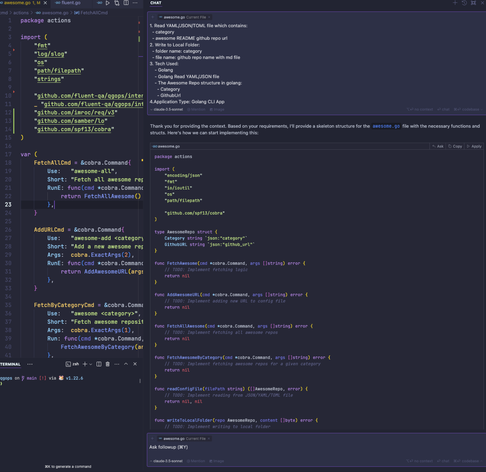

# Fetch Awsome Repo

Features and Requirements:
1. Read YAML/JSON/TOML file which contains:
  - category
  - awesome README github repo url
2. Write to Local Folder:
  - folder name: category
  - file name: github repo name with md file
3. Tech Used:
    - Golang
    - Golang Read YAML/JSON file
    - The Awesome Repo structure in golang:
      - Category
      - GithubUrl
4.Application Type: Golang CLI App
5.Code Based on qops
6.Also create CLI command for:
  - add aswesome url to configure file
  - run fetch all awesome command
  - run fetch all awesome for given category
7. setup github action to schedule work
8. All the awesome file is in separate github repo
9. All Code generate in Cursor or Claude

