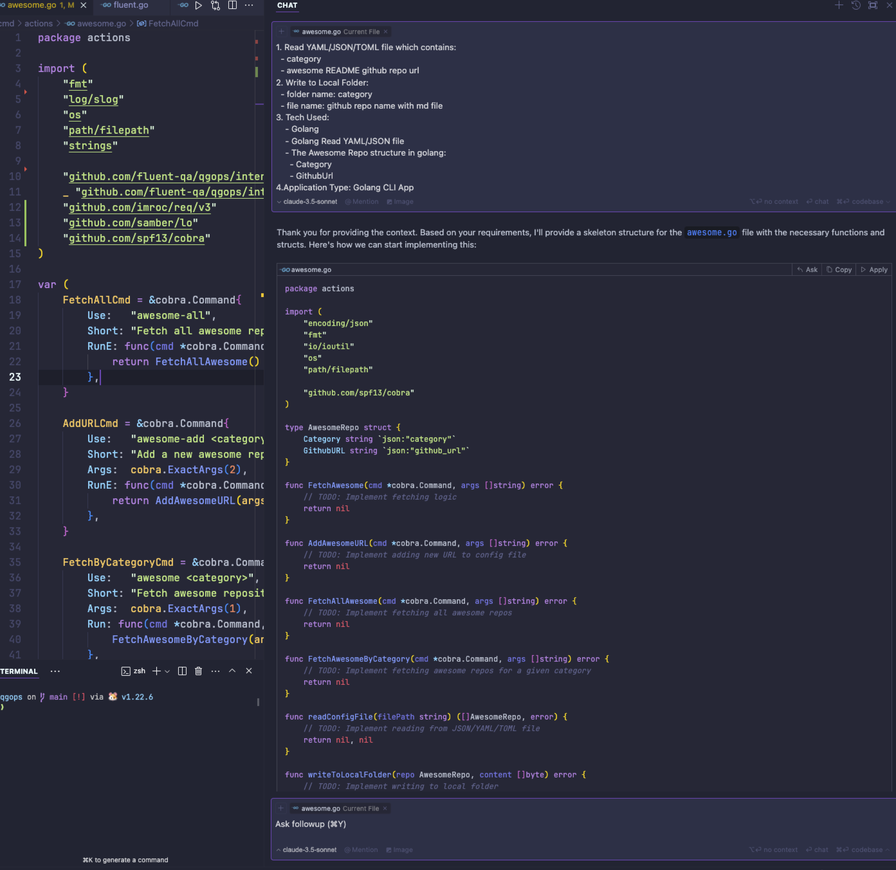
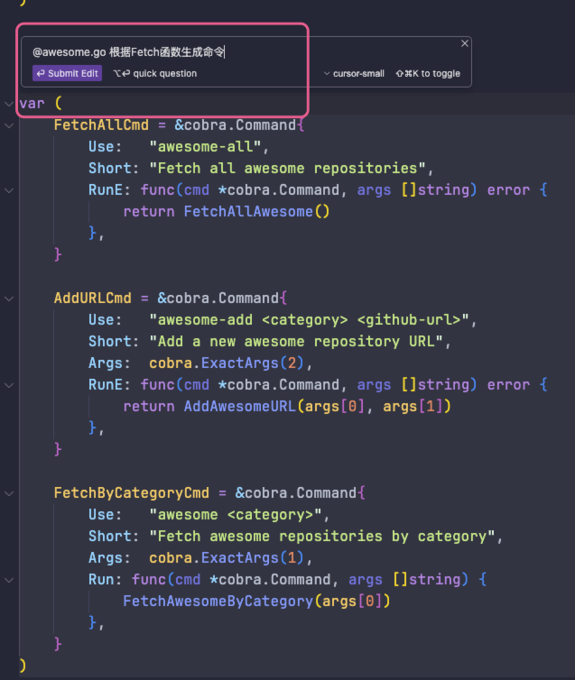
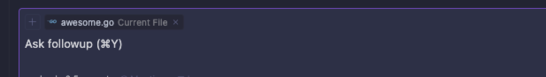
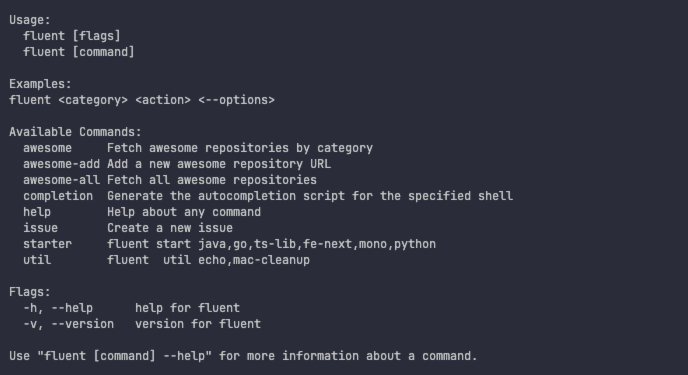

# Fetch Awsome Repo
使用Cursor，编程尝试主要需求就是聚合github上的一些awesome repo,保存到本地,方便阅读和做成
RSS feeds.

方法如下:

- ***prompt***: 
Features and Requirements:
```md
1. Read YAML/JSON/TOML file which contains:
  - category
  - awesome README github repo url
2. Write to Local Folder:
  - folder name: category
  - file name: github repo name with md file
3. Tech Used:
    - Golang
    - Golang Read YAML/JSON file
    - The Awesome Repo structure in golang:
      - Category
      - GithubUrl
4.Application Type: Golang CLI App
5.Code Based on qops
6.Also create CLI command for:
  - add aswesome url to configure file
  - run fetch all awesome command
  - run fetch all awesome for given category
1. setup github action to schedule work
2. All the awesome file is in separate github repo
3. All Code generate in Cursor or Claude
```

- 结果如下: 代码的结构和段落基本完成

- ctrl+k,在每一个函数上生成每一个函数的实现

- 或者add context到指定文件进行提问
  
- 效果
